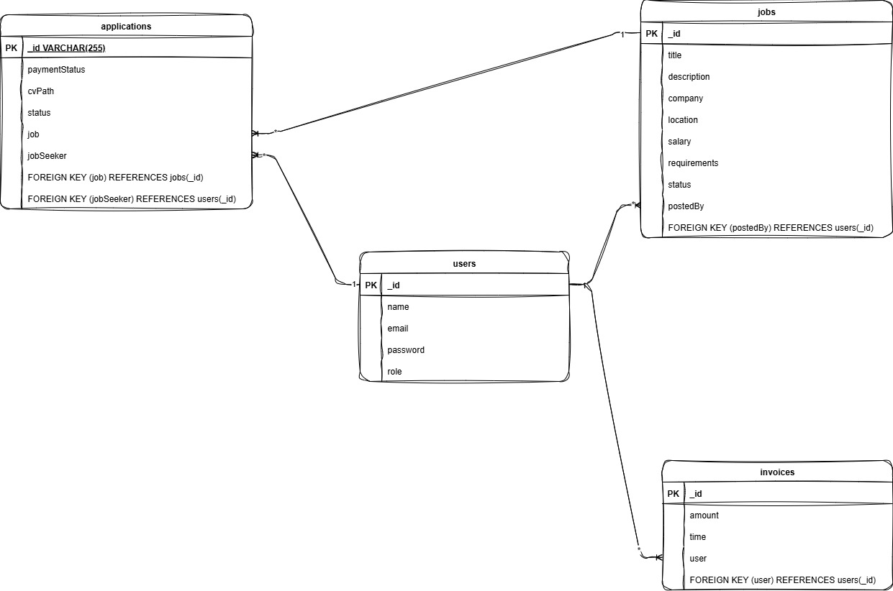

<h1 align="center">HireMe - Job Posting Platform Backend</h1>

<p align="center">
  <a href="https://hireme-4pqk.onrender.com">
    
  </a>
  <a href="https://documenter.getpostman.com/view/46559868/2sB3BGFpD5">
    
  </a>
</p>

<p align="center">
  A robust backend system for a job posting platform, built with modern web technologies.
</p>

## 🚀 Tech Stack

<p>
  
  
  
  
  
  
  
</p>

## ✨ Features

-   **Role-Based Authentication**: Secure routes using JWT for Admins, Employees, and Job Seekers.
-   **Job & User Management**: Employees can post, edit, and delete jobs. Admins have full control to manage all users and jobs.
-   **Job Application**: Job Seekers can apply with a CV and a mock payment.
-   **Admin Panel & Analytics**: Admins can view all users, jobs, and applications with filtering, and access platform-wide analytics.

---

## 📌 Table of Contents

1.  [Roles & Permissions](#-roles--permissions)
2.  [Setup & Installation](#-setup--installation)
3.  [API Endpoints](#-api-endpoints)
4.  [Payment Flow](#-payment-flow)
5.  [ERD](#-erd)

---

## 🔒 Roles & Permissions

-   **Admin**: Manages all users, jobs, and applications; views analytics.
-   **Employee (Recruiter)**: Posts, edits, and deletes their company's jobs; manages applicants.
-   **Job Seeker**: Views jobs, applies after payment, and tracks their application history.

## ⚙️ Setup & Installation

1.  **Clone the repository**:
    ```bash
    git clone https://github.com/nhumayun2/HIREME.git
    cd hireme-backend
    ```
2.  **Install dependencies**:
    ```bash
    npm install
    ```
3.  **Configure environment variables**:
    -   Create a `.env` file and add your MongoDB URI and a JWT secret.
    ```env
    PORT=5000
    ```
4.  **Run the application**:
    ```bash
    npm run dev
    ```

## 🗺️ API Endpoints

All endpoints are prefixed with `/api`.

### Authentication
-   `POST /api/auth/register` - Register a new user.
-   `POST /api/auth/login` - Log in and get a JWT token.

### Jobs
-   `POST /api/jobs` - Create a new job post (Protected: Employee, Admin).
-   `GET /api/jobs?company=...&status=...` - Get all job listings with optional filtering (Public).
-   `GET /api/jobs/:id` - Get a single job by ID (Public).
-   `PUT /api/jobs/:id` - Update a job (Protected: Employee, Admin).
-   `DELETE /api/jobs/:id` - Delete a job (Protected: Employee, Admin).

### Applications
-   `POST /api/applications/apply` - Apply for a job (Protected: Job Seeker). Requires `multipart/form-data` with `jobId` and `cv` file.
-   `GET /api/applications/my-applications` - View a job seeker's application history (Protected: Job Seeker).
-   `GET /api/applications/:jobId?status=...` - View applications for a job with optional filtering (Protected: Employee, Admin).
-   `PATCH /api/applications/status/:applicationId` - Update an application's status (Protected: Employee, Admin).

### Admin
-   `GET /api/admin/users` - Get all user accounts (Protected: Admin).
-   `POST /api/admin/users` - Create a new user (Protected: Admin).
-   `PUT /api/admin/users/:id` - Update a user (Protected: Admin).
-   `DELETE /api/admin/users/:id` - Delete a user (Protected: Admin).
-   `GET /api/admin/users/analytics` - Get platform-wide analytics (Protected: Admin).

## 💸 Payment Flow

1.  A **Job Seeker** authenticates and obtains a JWT token.
2.  They send a `POST` request to `/api/applications/apply` with the `jobId` and their CV file.
3.  The backend simulates a successful payment of 100 Taka.
4.  An invoice is stored, and the application is saved with `paymentStatus: true`.

## 📐 ERD

The Entity-Relationship Diagram for the project.



## Postman Documentation

The Postman documentation for this API is available [here](https://documenter.getpostman.com/view/46559868/2sB3BGFpD5).
